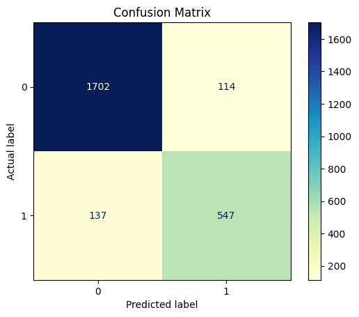

# Telecommunication Customer Churn Analysis

<b>1. Project Overview</b>
- This project analyzes customer churn in a telecommunications company. The goal is to identify key factors influencing churn and provide actionable insights to improve customer retention.

<b>2. Dataset Description</b>
- Dataset: "churn_clean.csv"
- Key Features:
  - `Gender`: Customer self-identification as male, female, or nonbinary
  - `Tenure`: Number of months the customer has stayed with the provider
  - `Techie`: Whether the customer considers themselves technically inclined
  - `Multiple`: Whether the customer has multiple lines
  - `OnlineBackup`: Whether the customer uses an online backup add-on
  - `TechSupport`: Whether the customer uses a technical support service
  - `StreamingTV`: Whether the customer has TV streaming add-on
  - `StreamingMovies`: Whether the customer has movie streaming add-on
  - `InternetService`: Customer's internet service provider
  - `Contract`: Contract term of the customer
  - `PaymentMethod`: Customer's payment method

 <b>3. Problem Statement</b>
 - Customer churn significantly impacts revenue. By gaining insights into key factors and identifying customer segments at risk, the organization can use churn analysis not only to enhance services for current customers but also to foster long-term business growth.

<b>4. Data Cleaning & Preprocessing</b>
- Handling missing values and duplicates
- Identify outliers
- Encoding categorical variables

<b>5. Exploratory Data Analysis (EDA)</b>
- Identify distribution of each variable (Univariate)
- Analyze the relationship between churn vs. non-churn customers across each predictor (Bivariate)

<b>6. Model Development</b>
- Machine learning model used: Logistic Regression
- Performance metrics: Accuracy, Precision, F1 Score
- Result:
  - Logistic Regression model:

    

  - Model Evaluation Metrics:
    - Pseudo R-squared = 0.6126
    - Log-likelihood = -1671.6
    - LLR P-value = 0.000

  - Confusion Matrix:

    

  - Performance Metrics:
    - Accuracy: 0.8996
    - Precision: 0.8275
    - F1 Score: 0.8133

<b>7. Key Findings</b>
- Regression Equation:
  
  log=(P(Churn=Yes))/(P(Churn=No))  = -1.796 + 1.1956(Techie_Yes) + 1.6557(Multiple_Yes) + 0.7888(OnlineBackup_Yes) + 0.1902(TechSupport_Yes) + 3.0377(StreamingTV_Yes) + 3.4977(StreamingMovies_Yes) + 0.2438(Gender_Male) – 3.3676(Contract_One_Year) – 3.4149(Contract_Two_Year) – 1.3373(InternetService_Fiber Optic) – 1.3819(Internet_No Service) + 0.4883(PaymentMethod_Electronic Check) – 0.11(Tenure)

- Interpretation of coefficients:
  - Constant = -1.796
    - Odds ratio: e^(-1.796) ≈ 0.17
    - The baseline odds of churn is approximately 0.17 when all predictors are constant.
  - Techie_Yes = 1.1956
    - Odds ratio: e^1.1956 ≈ 3.30
    - Change in odds ratio: (3.3 – 1) x 100% = 230% increase
    - Techie customers are 3.3 times more likely to churn than non-techie customers
  - Multiple_Yes = 1.6557
    - Odds ratio: e^1.6557 ≈ 5.24
    - Change in odds ratio: (5.24 – 1) x 100% = 424% increase
    - Customers using multiple lines are 5.24 times more likely to churn than those who do not have multiple lines.
  - OnlineBackup_Yes = 0.7888
    - Odds ratio: e^0.7888 ≈ 2.20
    - Change in odds ratio: (2.2 – 1) x 100% = 120% increase
    - Customers using an online backup service are 2.2 times more likely to churn than those who are not.
  - TechSupport_Yes = 0.1902
    - Odds ratio: e^0.1902 ≈ 1.21
    - Change in odds ratio: (1.21 – 1) x 100% = 21% increase
    - Having tech support services increases the odds of churn by about 21% compared to those without tech support.
  - StreamingTV_Yes = 3.0377
    - Odds ratio: e^3.0377 ≈ 20.85
    - Change in odds ratio: (20.85 – 1) x 100% = 1985% increase
    - Customers using Streaming TV services are 20.85 times more likely to churn than those who are not.
  - StreamingMovies_Yes = 3.4977
    - Odds ratio: e^3.4977 ≈ 32.99
    - Change in odds ratio: (32.99 – 1) x 100% = 3199% increase
    - Customers using Streaming Movie services are 32.99 times more likely to churn compared to those who are not.
  - Gender_Male = 0.2438
    - Odds ratio: e^0.2438 ≈ 1.28
    - Change in odds ratio: (1.28 – 1) x 100% = 28% increase
    - Male customers have 28% higher odds of churn compared to those who are not male.
  - Contract_One year = -3.3676
    - Odds ratio: e^(-3.3676) ≈ 0.034
    - Change in odds ratio: (0.034 – 1) x 100% = 96.6% decrease
    - A one-year contract causes a reduction of 96.6% in the odds of churning compared to having a month-to-month contract.
  - Contract_Two year = -3.4149
    - Odds ratio: e^(-3.4149) ≈ 0.033
    - Change in odds ratio: (0.033 – 1) x 100% = 96.7% decrease
    - A two-year contract causes a reduction of 96.7% in the odds of churning compared to a month-to-month contract.
  - InternetService_Fiber Optic: -1.3373
    - Odds ratio: e^(-1.3373) ≈ 0.26
    - Change in odds ratio: (0.26 – 1) x 100% = 74% decrease
    - Using Fiber optic internet causes a reduction of 74% in the odds of churning compared to using DSL.
  - InternetService_No service: -1.3819
    - Odds ratio: e^(-1.3819) ≈ 0.25
    - Change in odds ratio: (0.25 – 1) x 100% = 75% decrease
    - Not using the internet service causes a reduction of 75% in the odds of churning compared to using the internet service.
  - PaymentMethod_Electronic Check: 0.4883
    - Odds ratio: e^0.4883 ≈ 1.63
    - Change in odds ratio: (1.63 – 1) x 100% = 63% increase
    - Customers who pay by electronic check are 1.63 times more likely to churn than those using other payment methods.
  - Tenure: -0.11
    - Odds ratio: e^(-0.11) ≈ 0.90
    - Change in odds ratio: (0.9 – 1) x 100% = 10% decrease
    - For each additional month, the odds of churn decrease by about 10%.

<b>8. Limitations & Recommendations</b>
- Limitations:
  - Despite the strengths of the reduced model in terms of statistical and practical significance, this analysis has limitations. Logistic regression assumes a linear relationship between predictors and the log-odds of the target variable; however, non-linear relationships may not be fully captured, potentially affecting model accuracy. Moreover, the pseudo R-squared value of 0.6126 in the reduced model on a scale of 0 to 1 indicates room for improvement in model fit.

- Recommendations:
  - Identifying significant factors that impact customer churn can help businesses enhance their services and implement more effective customer retention strategies. Based on the interpretation of the regression equation, organizations can strengthen factors that reduce churn while modifying or further investigating those that contribute to higher churn rates.
  - To improve model performance, future analyses should examine the relationship between the predictors and the log-odds of the dependent variable. If the relationship is non-linear, alternative models such as tree-based methods or Support Vector Machines (SVM) may better capture interactions between variables that logistic regression might overlook. Additionally, incorporating evaluation metrics beyond pseudo-R-squared and log-likelihood will provide a more comprehensive assessment of model accuracy.

<b>9. Technologies & Tools Used</b>
- Python (Pandas, NumPy, Scikit-learn, Statsmodels, Matplotlib, Seaborn)
- Jupyter Notebook
